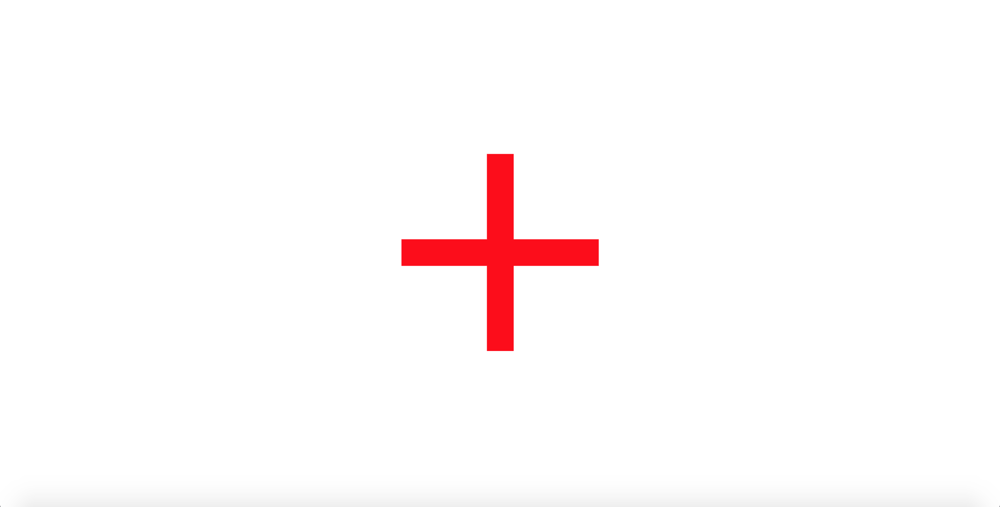
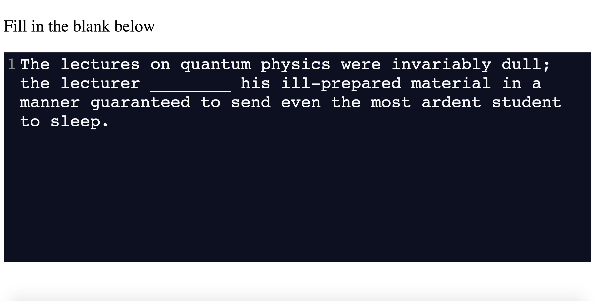

# CodeSynthViewer -- ICSE 2020

The software used for conducting experiments as described in "Neurological Divide: An fMRI Study of Prose and Code Writing" at [ICSE 2020](https://conf.researchr.org/home/icse-2020). This repository permits both (1) the reproduction and validation of our results and experimental protocol, as well as (2) the adaptation of this software for similar human studies of software engineering activities (with or without medical imaging). For reproduction of the conclusions drawn from the data collected in our study, we make available [all participant keystroke and answer data](https://dijkstra.eecs.umich.edu/fmri/icse20-data), as well as the de-identified medical imaging data (contact [Dr. Westley Weimer](weimerw@umich.edu)).

## Getting Started

General usage for CodeSynthViewer involves a [Node.js](https://nodejs.org/en/) back-end and a locally-hosted web-based front-end. General usage requires the following steps:

1. Start the **Backend Server**, specifying the participant ID (used for a random number generator seed as well as for naming output files/directories) and the category (unique to the user's experimental design). Both are positive integers
2. Open the **Presenter** in a web browser
3. Press the designated key to start the experiment (default is "=")

To start the Backend Server, use

``node server.js [PARTICIPANT-ID] [CATEGORY]``

Then, open ``presenter.html`` in a web-browser. Lastly, press the designated start key. Below are sample images of expected behavior:

Rest Period             |  Active Stimulus
:-------------------------:|:-------------------------:
  |  

To replicate our experiments with a random ordering (e.g., random participant ID = 99), use the following commands:

* ``node server.js 99 [0-3]``
* ``open presenter.html``
* Press the "=" key

Note that we used four different categories of stimuli in our study. Each experiment can be run separately by selecting one of [0-3] as the category ID. In our study, the category IDs correspond to the following categories (FITB = Fill in the Blank, LR = Long Response):

0. Prose, FITB
1. Prose, LR
2. Code, FITB
3. Code, LR

The stimuli can be found in ```stimuli.json``` and are defined in this order.

### Prerequisites 

The Backend Server is built with [Node.js](https://nodejs.org/en/) and requires the following packages:
* http
* path
* request
* express
* fs
* shuffle-seed

The above packages should be installed using the [Node Package Manager](https://nodejs.org/en/knowledge/getting-started/npm/what-is-npm/) in the ```code-synth-viewer``` directory (e.g., ```cd path/to/code-synth-viewer; npm install shuffle-seed```). This will create a directory ```node_modules``` in ```code-synth-viewer```. 

## Configurability

This software is made public to make possible both (1) the reproduction and validation of our results and experimental protocol, as well as (2) the adaptation of this software for similar studies of software engineering activities with medical imaging. The following instructions provide details on how one can adapt this software for the needs of similar studies.

### Stimuli

#### Contents

You can run experiments with your own custom stimuli. The stimuli are stored in JSON format, and are loaded in ```presenter.html``` with ```<script type="text/javascript" src="stimuli.json"></script>```. You can replace this with your own JSON file.

Each run of the software runs one "category" of stimuli. Each category of stimuli is represented as a list in JSON format. For example, we used 4 categories of stimuli and therefore our stimuli JSON file consists of 4 lists.

Each element of a list is a stimulus, represented by a dictionary. Each stimulus has several required properties:
* prompt: The text to display as the stimulus prompt
* text: The text to appear in the body of the text editor.
* line/character: The position at which the cursor in the editor should start. For example, for our questions that required filling in a blank, we included a series of underscores ('\_') in the text section and denoted the line and character as the middle of these underscores.

A minimal example with two categories, each including two stimuli, follows:

```
var stimuli = [
  [
    {
      "prompt": "Fill in the blank below",
      "text": "To reach Simonville, the traveller needs to drive with extreme caution along the windy curves of the ________ road that climbs steeply to the summit.",
      "line": 0,
      "character": 105 
    },
    {
      "prompt": "Fill in the blank below",
      "text": "The admiral rescinded her ________ to attack when she saw the white flag raised by the enemy sailors; she was relieved that she could bring an end to the hostilities.",
      "line": 0,
      "character": 30
    }
  ],
  [
    {
      "prompt": "Using two statements, complete the definition of the function swapints that is passed two int variables. The function returns nothing but exchanges the values of the two variables.",
      "text": "void swapints(int &a, int &b){\n\tint temp = a;\n\t/* YOUR CODE HERE */\n\t\n}\n",
      "line": 3,
      "character": 1
    },
    {
      "prompt": "Write a function addOne that adds 1 to its integer reference parameter. The function returns nothing.",
      "text": "void addOne (int& x) {\n\t/* YOUR CODE HERE */\n\t\n}\n",
      "line": 2,
      "character": 1
    }
  ]
]
```


#### Code

Changing the stimuli likely requires several changes to the code itself. The first change involves the logic in ```server.js``` to establish the number of stimuli. For context, the existing logic supports our experimental design -- FITB categories (i.e., categories 0 and 2) had 17 stimuli each whereas LR categories (i.e., categories 1 and 3) had 9 stimuli each. It is shown below:

```
// Set number of stimuli according to category
var NUM_STIMULI = 9 // stim_category == 1 || stim_category == 3
if (stim_category == 0 || stim_category == 2) {
  NUM_STIMULI = 17;
}
```

We note that the software could be easily adapted to determine the number of stimuli simply as the length of the list of stimuli for the associated category. For our study, we hardcoded this logic.

Adapting this software for one's own purposes likely also involves adjusting the time duration of stimuli presentation. This is discussed in the following section, along with other timing-related possibilities for configuration. 


### Timing
Similar to the number of stimuli, the time duration of each stimulus is handled by the server side. The time duration of each stimulus is chosen on a per-category basis, and having different timings within a category is not currently supported.

As before, the current code can be understood in the context of our own study. Participants had 30s to complete FITB tasks and 60s to complete LR tasks. The existing logic is shown below:

```
// Choose the appropriate length of stimuli presentation based on category type
stimuli_time = 30000
if (stim_category == 1 || stim_category == 3) {
  stimuli_time = 60000
}
```

Note that timings are stored in ms (e.g., 30s = 30,000 ms). 

In addition to the time-per-stimulus, various other timing aspects of the software can be adjusted:
* Average Rest Time: Between each stimulus, a fixation cross is shown to the participant for a variable amount of time. While the exact amount of time is variable, you can set an average amount of time per rest period by changing the value of ```avg_rest_time``` in ```presenter.html```. The current value is set to 5s (5000 ms).
* First Stimulus Buffer: In our experiment, we wanted a buffer of 10s at the beginning of the experiment upon pressing the start key to allow the MRI field to settle. In other words, pressing the start key prompted a 10s countdown to the experiment. You can adjust this countdown by changing the value of ```first_stim_buffer``` in ```presenter.html``` (or set it to 0 for no buffer).

### Text Editor

A key benefit of our software for studying software enginering tasks with medical imaging is that, unlike popular software for psychology studies (e.g., ePrime), it supports text editing. We make use of [CodeMirror](http://www.codemirror.net) for this purpose, which supports various language modes and advanced editing functionalities (e.g., syntax highlighting).

When adapting the software for your own needs, you can customize the syntax highlighting of the text-editor on a per-category basis in ```presenter.html```. As an example, the logic used for our usage is shown below and can be understood in the context of our study -- categories 0-1 involved prose writing whereas categories 2-3 involved writing C++ code. 

```
// Set the CodeMirror syntax highlighting for the stimulus
// Permits multiple styles of stimuli in a single experimental block
if (data.category == Categories.ProseWritingFITB || data.category == Categories.ProseWritingLR) {
  editor.setOption("mode", "text/plain");
} else {
  editor.setOption("mode", "text/x-c++src");
}
```

For a complete list of the programming languages supported by the text editor and the corresponding keywords to use a given language, see [here](https://codemirror.net/mode/). The software does not currently support within-category changes to syntax highlighting. However, this design permits such a change by adding logic to the category included in the server-side ```nextstim``` API.

### Start Key

The software waits for a key press from a designated start key to start the experiment (to help synchronize with the medical imaging scan). Upon receiving signal from said start key, the experiment begins: a fixation cross is shown for the alotted buffer time, and the participant is then presented with the first rest/stimulus pair (i.e., start key pressed &rarr; first stimulus buffer &rarr; first rest &rarr; first stimulus &rarr; second rest &rarr; ...).

In our experiment, we used the equals sign ("=") as our start key. However, this can be easily configured. The start key is determined in ```presenter.html``` in the following code snippet:

```
// If start key detected, start the experiment. Triggers first call to displayNextStimulus
if (event.keyCode == 187) {
  console.log("Start key detected")
  var the_url ="http://localhost:3000/start";
  $.ajax(
    { url: the_url, complete: function() {} }
  );
  has_started = true;
  stopped = false;
  startTimer();
}
```

Note that various browsers may use different keycodes for the same key. For example, 61 is the keycode for "=" in Firefox but the keycode for "=" for all other browsers is 187. For a full list of keycodes, [this](https://keycode.info/) is a useful website.

## Output

To reiterate, a key benefit of our software is the ability to capture text output (e.g., via an MRI-safe QWERTY keyboard) from experiment participants in medical imaging studies. Our software captures participant responses at two levels of granularity: (1) all keystrokes typed by the participant, and (2) question/answer-style recording. Again, experiments are conducted on a per-category level -- a single experiment is the presentation of a set of stimuli (i.e., a category of stimuli) to a participant. This is reflected in the two required command-arguments (i.e., participant ID and category number). For each experiment (i.e., a pair of participant ID and category number), two files are generated -- a keystrokes file, and an answer file.

### Keystrokes

Once the experiment has started (i.e., the start key has been pressed), all keys pressed by the participant are recorded until the experiment is finished. Keystroke information is recorded in the following format:

* Pairs of ```(current time in ms, keycode)```. The recorded time is arbitrary and is relative only to the start of the server
* Stimulus demarcation (i.e., "new stimulus")

All items are separated by newlines. The following is a minimal example of a keystrokes file:

```
58596205.678034, 16
58596235.879504, 224
58596567.035268, 82
new stimulus
58665814.399911, 16
58665821.830611, 224
new stimulus
...
```

In the above example, the participant pressed three keys before the first stimulus was shown, and two keys in response to the first stimulus.

Keystroke files are saved in the ```keystrokes``` directory and named in the following format:

```keystrokes/keystrokes-<participant id>-<category>.txt```

For example, the keystrokes file for participant 99's completion of category 0 would be saved in ```keystrokes/keystrokes-99-0.txt```.

### Answers

Participant output is also saved in a stimulus-by-stimulus fashion. Answer output is saved in CSV format with the following columns, where each row includes information for a single stimulus:

* participant-id: The ID of the participant completing the expeirment
* category: The category that the participant is completing
* timestamp: The current time in ms. The recorded time is arbitrary and is relative only to the start of the server
* prompt: The prompt displayed at the top of the screen. For example, for the FITB questions in our study, the prompt read "Fill in the blank below". For the LR questions in our study, the prompt was variable.
* answer: The participant's typed response, including any text that began in the text box. For example, for the FITB questions in our study, this column would include the entire completed sentence with the participantss answer inserted in the blank. For the LR questions in our study, this would include the participant's entire typed response.
* stimulus-id: The numerical ID of the stimulus. This corresponds to the index of the stimulus in its associated JSON list.
* previous-delay: The duration that the fixation cross was shown to the participant prior to the stimulus. In other words, the rest time before the stimulus.
* stimulus_time: The duration that the stimulus was shown for in ms (e..g, in our study this was either 30000 or 60000)

The following is a minimal example of an answers file. The participant ID is 101 and the category ID is 0 (FITB Prose):

```
participant-id,category,timestamp,prompt,answer,stimulus-id,previous-delay,stimulus_time
101,0,57706473.599629,Fill in the blank below,New York fashion designer Anna Sui creates eclectic ____designs____ that represent an amalgam of playful, 1970's funky style fused with an edgy, urban sensibility.,8,12648.480850758842,30000
101,0,57741527.124666,Fill in the blank below,Since the foreign correspondent was accustomed to completing his ____work____ under tumultuous conditions, the commotion of the subway at rush hour presented no impediment to his creativity.,6,5042.64261732144,30000
101,0,57775842.91456,Fill in the blank below,Over the years the anthropologist's opinions had ossified: he refused to tolerate new ideas and nothing could ____change____ his mind.,13,4303.942733144843,30000
participant-id,category,timestamp,prompt,answer,stimulus-id,previous-delay,stimulus_time
...
```

Answer files are saved in the ```answers``` directory and named in the following format:

```answers/answers-<participant id>-<category>.txt```

For example, the answers file corresponding to the above example (participant 101's completion of category 0) would be saved in ```answers/answers-101-0.txt```.

## Built With

* [CodeMirror](http://www.codemirror.net) - The code editor in the browser
* [Node.js](https://www.nodejs.org) - Javascript for Backend Server

## Authors

* Ryan Krueger - ryankrue@umich.edu
* Kevin Leach - kjleach@umich.edu

See our [ICSE 2020 paper](www.fixme.org) for a full list of study authors.
